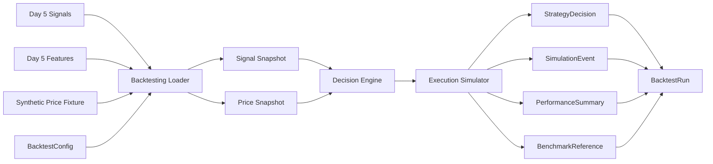

# Backtesting And Simulation

## Purpose

Day 6 adds the first honest backtesting and simulation boundary on top of the Day 5 candidate signal pipeline.

This layer exists to validate engine mechanics and temporal hygiene. It does not claim alpha, and it does not produce portfolio-ready outputs.

## Input Boundary

The Day 6 workflow consumes:

- persisted Day 5 `Signal` artifacts
- persisted Day 5 `Feature` artifacts
- an explicit `BacktestConfig`
- an explicit `ExecutionAssumption`
- a clearly labeled synthetic daily price fixture

It does not consume raw documents, memo prose, or portfolio proposals.

## Architecture

## Service Boundary

`services/backtesting/` now owns:

- loading persisted signals and features
- loading the synthetic price fixture
- snapshot construction
- deterministic decisioning
- delayed execution simulation
- benchmark generation
- local artifact persistence

The public executable boundary is `BacktestingService.run_backtest_workflow()`.

The older queued `run_backtest()` stub still exists for service discovery, but it is not the Day 6 execution path.

## Decision Rule

Day 6 intentionally keeps the rule simple:

- evaluate one company at a time
- on each daily decision point, consider only signals with `effective_at <= decision_time`
- apply any configured signal-availability buffer before eligibility
- reject any signal whose referenced features are not yet available by `decision_time`
- choose the latest eligible signal
- break ties by larger absolute `primary_score`, then stable `signal_id`
- map stance to unit exposure:
  - `positive -> +1`
  - `negative -> -1`
  - `mixed | monitor -> 0`
- execute changes at next-bar open using `execution_lag_bars = 1`

## Artifact Flow

Day 6 persists:

- `BacktestConfig`
- `ExecutionAssumption`
- `DataSnapshot`
- `StrategyDecision`
- `SimulationEvent`
- `PerformanceSummary`
- `BenchmarkReference`
- `BacktestRun`

Local storage layout:

- `artifacts/backtesting/configs/`
- `artifacts/backtesting/runs/`
- `artifacts/backtesting/snapshots/`
- `artifacts/backtesting/decisions/`
- `artifacts/backtesting/events/`
- `artifacts/backtesting/performance_summaries/`
- `artifacts/backtesting/benchmarks/`

## Benchmarks

Day 6 emits exactly two mechanical benchmarks:

- `flat_baseline`
  - no trades
  - constant cash
- `buy_and_hold`
  - long one unit from the first executable bar through the end of the test window
  - uses the same synthetic daily price fixture as the exploratory run

These are engine-validation baselines, not investment recommendations.

## Current Assumptions

- daily bars only
- one company at a time
- unit positions only
- candidate signals are allowed as explicit dev-only inputs
- every Day 6 run is `exploratory_only`
- synthetic prices are test infrastructure only
- ending account value is marked to market, not forced liquidation

## What Day 6 Does Not Do

Day 6 does not provide:

- validated strategy performance claims
- realistic microstructure modeling
- multi-asset portfolio simulation
- portfolio optimization
- live trading
- hidden signal promotion

## Known Limitations

- signals do not yet expire or decay
- the execution model is next-bar open only
- transaction costs and slippage are simple basis-point assumptions
- the price fixture is synthetic and intentionally small
- there is no promotion gate yet between exploratory runs and validated signal research
