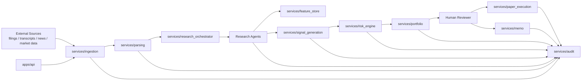
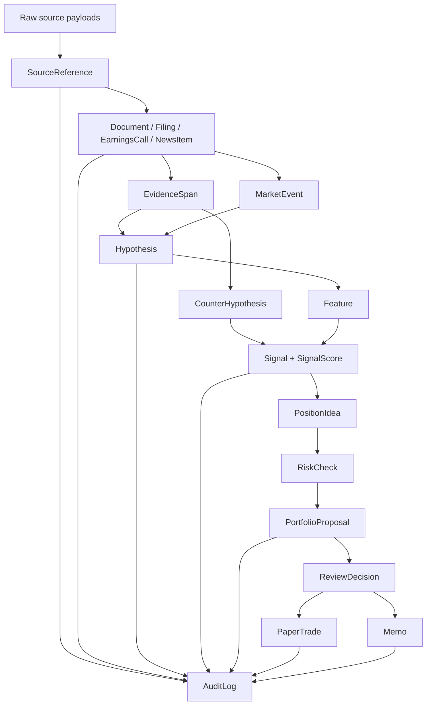
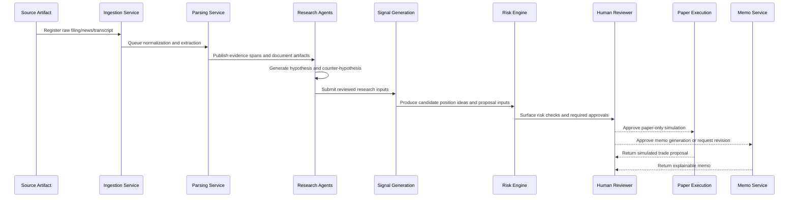

# Day 1 Architecture

This document describes the Day 1 architectural boundary that was established first and then extended through Week 1. The contracts and service boundaries here are no longer mostly hypothetical: the local fixture-backed stack now runs from ingestion through paper-trade candidate creation.

## System Purpose

The purpose of this system is to provide a disciplined operating foundation for AI-native hedge fund research and paper trading. Day 1 does not try to produce alpha. It establishes the contracts, control points, and workflow boundaries required so later research can move quickly without losing provenance, temporal hygiene, or human oversight.

## Non-Goals

- live trading
- autonomous execution
- broker connectivity
- production-grade storage and infra
- real backtest performance claims
- unreviewed agent autonomy

## Design Philosophy

- Research-first, execution-later
- Explicit contracts before integrations
- Traceable artifacts before optimization
- Human review before simulated action
- Temporal rigor before backtest speed
- Modular services before monolithic pipelines

## Major Components

- `apps/api`: control-plane API for health, discovery, and artifact-backed inspection entrypoints
- `services/ingestion`: registers raw upstream artifacts
- `services/parsing`: normalizes text and extracts evidence-bearing structures
- `services/research_orchestrator`: coordinates multi-step research cycles
- `services/feature_store`: stores and retrieves point-in-time features
- `services/signal_generation`: turns reviewed research and features into candidate signals
- `services/backtesting`: exploratory point-in-time strategy evaluation boundary
- `services/risk_engine`: pre-portfolio and pre-trade policy checks
- `services/portfolio`: constructs constrained paper portfolio proposals
- `services/paper_execution`: creates human-reviewable paper trades only
- `services/memo`: produces explainable memos from reviewed artifacts
- `services/audit`: persists local immutable audit events
- `agents/*`: specialized research agents with explicit tool and action boundaries
- `libraries/schemas`: canonical typed contracts across the platform

## High-Level Architecture

## Service Boundaries

- `ingestion` owns source registration and raw artifact intake. It does not perform semantic extraction.
- `parsing` owns normalization and evidence extraction. It does not invent research conclusions.
- `research_orchestrator` owns workflow coordination. It does not own portfolio logic.
- `feature_store` owns point-in-time feature persistence and retrieval. It does not rank signals.
- `signal_generation` owns signal construction and scoring. It does not approve positions.
- `backtesting` owns temporally controlled evaluation. It does not authorize production behavior.
- `risk_engine` owns policy and exposure checks. It does not construct unconstrained portfolios.
- `portfolio` owns candidate portfolio assembly. It does not execute trades.
- `paper_execution` owns simulated trade expression only after human approval.
- `memo` owns explainable narrative synthesis for human review.
- `audit` owns event recording independently of all business services.

## Agent Boundaries

- Filing Ingestion Agent: may register filings, may not infer unsupported filing facts.
- Transcript Extraction Agent: may extract spans and speakers, may not summarize without traceable evidence.
- News Summarization Agent: may produce event summaries, may not convert news directly into trades.
- Hypothesis Generator Agent: may form theses, may not skip assumptions or fabricate evidence.
- Counterargument Agent: may challenge hypotheses, may not weaken critique to fit the original thesis.
- Signal Builder Agent: may create candidate signals, may not bypass feature or counterargument review.
- Risk Reviewer Agent: may flag issues, may not override human approval policy.
- Portfolio Construction Agent: may assemble constrained proposals, may not execute anything.
- Memo Writer Agent: may summarize reviewed artifacts, may not invent conviction or performance.

## Data Flow

## Control Flow

1. A source artifact is registered with source metadata and an explicit ingestion timestamp.
2. The document is normalized and parsed into evidence-bearing spans.
3. The orchestrator launches the relevant research agents.
4. Agents generate hypotheses and counter-hypotheses using only available evidence.
5. Features and candidate signals are built with explicit `as_of_time`, `available_at`, and lineage semantics.
6. Signals may lead to position ideas, but only after research review logic says they are eligible.
7. Exploratory backtests evaluate candidate signals under explicit temporal cutoffs.
8. Risk checks screen ideas and portfolio proposals before any simulated execution path exists.
9. Human reviewers approve, reject, or revise proposals.
10. Approved or review-ready proposals may become paper-trade candidates and memos.
11. Audit logs capture each material action.

## Artifact Flow

- Raw artifacts: source payloads, filings, transcript files, articles
- Normalized artifacts: cleaned text, speaker segments, evidence spans
- Derived artifacts: hypotheses, counter-hypotheses, features, signals, risk checks, proposals, memos
- Review artifacts: review decisions, approvals, rejections, escalations
- Simulation artifacts: paper trades and simulated fills

The artifact rule is strict: derived artifacts must point back to upstream artifacts. Free-floating conclusions are not allowed.

## Repository Layout Conventions

The repository-level layout mirrors the artifact model so future persistence work does not collapse layers together:

- `storage/raw/` for raw payloads
- `storage/normalized/` for cleaned and parser-friendly documents
- `storage/derived/` for machine-readable derived artifacts
- `storage/audit/` for durable audit and event storage
- `research_artifacts/` for human-reviewable evidence packs, memos, proposals, and paper-trade bundles

## Memory and State

The runtime remains local and simple, but it is no longer only in-memory:

- deterministic workflows persist local artifacts under `artifacts/`
- typed schemas define what more durable state will look like later
- `DataSnapshot` models define how reproducible datasets and replay windows should be referenced
- `DatasetManifest` and storage metadata still reserve the future dataset/storage control plane
- `AuditLog` is now persisted locally under `artifacts/audit/`

The repository also reserves explicit top-level homes for:

- `configs/` for versioned non-secret configuration assets
- `research_artifacts/` for reviewable research outputs and templates
- `storage/` for storage layout and dataset metadata conventions

Future persistent state should separate:

- raw object storage
- normalized artifact storage
- point-in-time feature storage
- experiment and backtest metadata
- approval workflow state
- audit ledger

## Provenance Tracking

Provenance is carried inside entities through `ProvenanceRecord`. At minimum, future production implementations should populate:

- source reference IDs
- upstream artifact IDs
- transformation name and version
- data snapshot ID where relevant
- ingestion and processing times
- code version or commit SHA

## Evals

Day 1 does not implement eval execution, but it establishes where evals belong:

- extraction evals around `parsing`
- hypothesis and counterargument evals around agent outputs
- feature reliability evals around `feature_store`
- signal stability evals around `signal_generation`
- temporal hygiene evals around `backtesting`
- recommendation explainability and coverage evals around `memo` and `risk_engine`

See [`docs/architecture/evals_framework.md`](./evals_framework.md).

## Risk Controls

Risk controls sit in two places:

- structural controls baked into the architecture: no live broker service, no autonomous execution path
- explicit risk review controls: `RiskCheck`, `PortfolioConstraint`, `ReviewDecision`, and paper-trade-only execution

The architecture makes it impossible on Day 1 for an agent recommendation to directly become a live order.

## Human Approval

Human approval sits between portfolio proposal and paper execution, and again anywhere material uncertainty or policy conflict is detected. This is intentionally redundant. The goal is not agent autonomy. The goal is disciplined research acceleration.

## Lifecycle of a Future Research Idea

## Future Extension Points

- replace stub services with persistent adapters without changing public contracts unnecessarily
- introduce workflow orchestration once connector volume justifies it
- add machine-readable contract publishing in `data_contracts/`
- add feature lineage and dataset manifests
- add approval workflow persistence and RBAC
- add research console UI once backend semantics are stable
- add broker and execution design only after paper-trading controls are mature and separately reviewed
