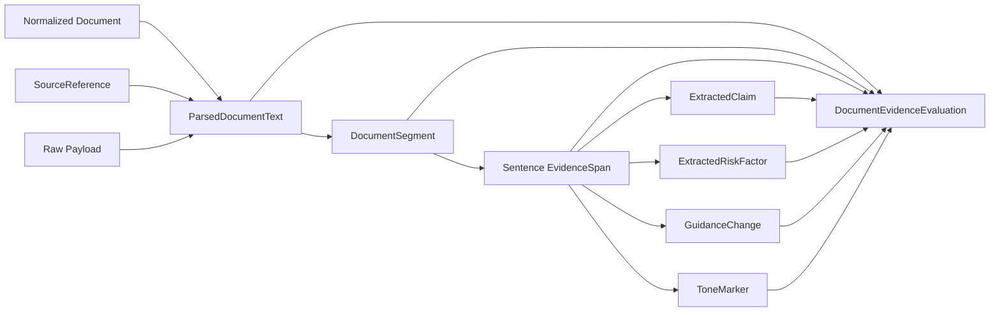

# Document Intelligence

## Purpose

Day 3 adds the first parser-owned document-intelligence layer on top of the Day 2 ingestion artifacts.

The goal is not summarization. The goal is to create modest, exact-span evidence artifacts that are:

- machine-readable
- reviewable
- provenance-linked
- safe for later hypothesis and signal workflows to consume

## Current Inputs

The parsing boundary currently operates on three explicit artifacts:

- a normalized document JSON
- a normalized `SourceReference` JSON
- the exact raw source payload JSON

This is intentional. Day 2 normalized documents do not yet carry parser-ready body text, so Day 3 creates a parser-owned text artifact without rewriting the ingestion contracts.

Day 16 clarification:

- parsing does not perform free-form company matching of its own
- instead, parsing refreshes the dedicated entity-resolution layer after evidence extraction persists

## Current Outputs

Current parser-owned outputs are:

- `ParsedDocumentText`
- `DocumentSegment`
- `EvidenceSpan`
- `ExtractedClaim`
- `ExtractedRiskFactor`
- `GuidanceChange`
- `ToneMarker`
- `DocumentEvidenceEvaluation`
- `DocumentEvidenceBundle`

## Flow

## Offset And Provenance Rules

- `ParsedDocumentText.canonical_text` is the single offset coordinate space for the parser output.
- All `DocumentSegment.start_char` and `end_char` offsets are relative to that canonical text.
- All `EvidenceSpan.start_char` and `end_char` offsets are also relative to that canonical text, never segment-local.
- `EvidenceSpan.segment_id` links every extracted sentence back to the parser segment that contained it.
- Extracted claims, risk factors, guidance changes, and tone markers all reference one or more `EvidenceSpan` IDs.
- Extracted statements are exact source slices, not paraphrases.

## Current Segmentation

- Filing: one `section` labeled `body`, then paragraph segments
- Transcript: one `section` labeled `prepared_remarks` unless explicit Q&A markers exist, then speaker-turn segments
- News: one `headline` segment, one `body` segment, then paragraph segments for the body

## Current Extraction Scope

What is extracted now:

- sentence-level evidence spans from leaf segments
- exact-span claims for explicit results, product updates, operational updates, outlook statements, and timeline statements
- guidance changes only when `guidance` or `outlook` language is paired with an explicit direction cue
- risk factors only when explicit risk or constraint language is present
- narrow lexical tone markers for confidence, caution, uncertainty, and improvement

What is not extracted yet:

- tables
- cross-sentence claims
- entity normalization inside claims
- numeric value decomposition into structured metrics
- nuanced sentiment scoring
- contradiction detection
- evidence ranking

## Current Storage Layout

Local parsing runs write artifacts under `artifacts/parsing/`:

- `parsed_text/`
- `segments/`
- `evidence_spans/`
- `claims/`
- `risk_factors/`
- `guidance_changes/`
- `tone_markers/`

Current Day 16 follow-on writes refreshed entity-linking artifacts under the sibling `artifacts/entity_resolution/` root when parsing completes.

## Eval Hooks

Each `DocumentEvidenceBundle` carries a lightweight evaluation report that checks:

- schema validity
- provenance completeness
- segment and evidence reference integrity
- exact span-to-text alignment
- basic coverage counts

This is an integrity harness, not a quality benchmark.

## Known Failure Modes

- transcript speaker parsing is regex-based and will fail on irregular headers
- sentence splitting is punctuation-based and will not handle complex financial formatting well
- risk extraction is intentionally sparse and may emit zero artifacts even when a human sees implicit risk
- tone markers are lexical only and should not be treated as sentiment scores
- missing extraction output does not imply absence of evidence

## Contract For Later Agents

Later agents may rely on:

- exact source text for `EvidenceSpan`
- exact canonical offsets
- resolved `segment_id` linkage
- explicit `source_reference_id` and provenance records
- sparse but structured claim, guidance, risk, and tone artifacts
- canonical company links only when entity resolution resolved safely

Later agents must not assume:

- completeness
- financial materiality ranking
- economic correctness of every extracted sentence
- that missing guidance, risk, or tone markers imply none exist
- that parser-owned text mentioning a company name is sufficient to force entity identity when the match is ambiguous
