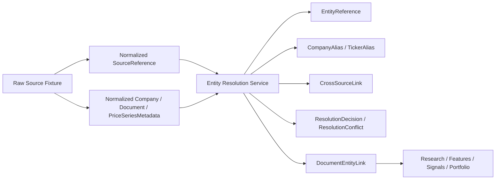

# Entity Resolution And Linking

## Purpose

Entity resolution is now an explicit platform layer instead of an implicit side effect of deterministic IDs.

The architecture goal is narrow:

- keep `company_id` as the canonical company key
- preserve aliases instead of discarding them
- record deterministic resolution decisions
- record conflicts when resolution is unsafe
- strengthen cross-source linking without inventing a full graph system

## Current Flow

## Current Runtime Boundaries

### Ingestion boundary

After normalized artifacts are written, the ingestion service now runs entity resolution for the affected workspace slice.

Current ingestion outputs feed:

- `EntityReference`
- `CompanyAlias`
- `TickerAlias`
- `CrossSourceLink`
- source-level `ResolutionDecision`
- document-level `ResolutionDecision`
- `DocumentEntityLink` when canonical document metadata already resolves safely

### Parsing boundary

After evidence extraction is written, the parsing service refreshes entity resolution for that document.

Current parsing contribution:

- mention-level headline or body links when exact unique alias matches exist
- `evidence_inherited` document links when parsing artifacts agree with the resolved company
- explicit blocking conflicts when parsing artifacts carry contradictory company IDs

## Current Storage Layout

Local entity-resolution artifacts are written under `artifacts/entity_resolution/` or a sibling workspace root:

- `entity_references/`
- `company_aliases/`
- `ticker_aliases/`
- `document_entity_links/`
- `cross_source_links/`
- `resolution_decisions/`
- `resolution_conflicts/`

## Cross-Source Linking Model

Current cross-source linking is metadata-first.

It strengthens:

- filings to companies
- transcripts to companies
- news to companies when metadata or exact unique mentions support it
- price metadata to companies
- document evidence to companies through inherited links
- signals and proposals by keeping their `company_id` aligned with the canonical resolved company

What it does not do:

- resolve instruments or listings as first-class objects
- infer company identity from weak textual similarity
- collapse ambiguous mentions into one winner

## Why This Layer Exists Separately

Entity resolution is not feature generation.
Entity resolution is not signal generation.
Entity resolution is not portfolio construction.

Keeping it separate avoids a common failure mode where every downstream workflow quietly performs its own ad hoc ticker or name matching. Day 16 moves that responsibility into one inspectable service with typed outputs and explicit conflict artifacts.

## Current Weak Spots

- canonical company mastering is still shallow; repeated reference-data writes can still update the canonical `Company` payload itself
- upstream loading is still not snapshot-native end to end
- there is still no first-class instrument or security reference contract
- unresolved or ambiguous cases are preserved correctly, but there is not yet a manual operator resolution workflow for them
