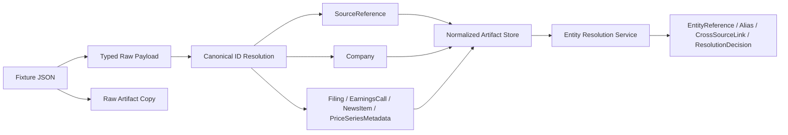

# Ingestion And Normalization

## Purpose

This document describes the first trustworthy ingestion backbone implemented in the repository.

The current scope is deliberately narrow:

- load a small local fixture set
- preserve exact raw source payloads
- normalize those payloads into canonical typed objects
- run metadata-first entity resolution for the affected workspace slice
- make timestamp handling explicit
- persist raw and normalized artifacts separately

This is not a provider-integration layer yet. It is the first clean local substrate for future parsing and evidence extraction.

## Supported Source Types

Current fixture-backed source coverage:

- SEC filings
- earnings call transcripts
- financial news
- company reference metadata
- price-series metadata placeholders

Current code paths live in:

- `services/ingestion/payloads.py`
- `services/ingestion/fixture_loader.py`
- `services/ingestion/normalization.py`
- `services/ingestion/storage.py`
- `services/ingestion/service.py`
- `pipelines/document_processing/fixture_ingestion.py`

## Current Flow

## Raw And Normalized Separation

The pipeline keeps the layers distinct:

- raw payloads are copied exactly as read from disk
- normalized artifacts are emitted as typed canonical JSON
- no feature engineering or evidence extraction happens during normalization

For local runs, artifacts are written under `artifacts/ingestion/` unless an explicit output root is provided.

Current local layout:

- `raw/<fixture_type>/<source_reference_id>.json`
- `normalized/source_references/<source_reference_id>.json`
- `normalized/companies/<company_id>.json`
- `normalized/filings/<document_id>.json`
- `normalized/earnings_calls/<document_id>.json`
- `normalized/news_items/<document_id>.json`
- `normalized/price_series_metadata/<price_series_metadata_id>.json`

Current Day 16 sibling layout:

- `../entity_resolution/entity_references/`
- `../entity_resolution/company_aliases/`
- `../entity_resolution/ticker_aliases/`
- `../entity_resolution/document_entity_links/`
- `../entity_resolution/cross_source_links/`
- `../entity_resolution/resolution_decisions/`
- `../entity_resolution/resolution_conflicts/`

## Canonical Objects Emitted

Each fixture produces a `SourceReference` plus one or more canonical objects:

- filing fixture: `SourceReference`, `Company`, `Filing`
- transcript fixture: `SourceReference`, `Company`, `EarningsCall`
- news fixture: `SourceReference`, optional `Company`, `NewsItem`
- company fixture: `SourceReference`, `Company`
- price metadata fixture: `SourceReference`, `Company`, `PriceSeriesMetadata`

`SourceReference` is the anchor for source identity and upstream timestamps.

Day 16 clarification:

- `Company.company_id` remains the canonical downstream company key
- alternate source names and ticker variants are preserved separately
- ingestion does not silently collapse ambiguous entity state

## Timestamp Handling

The pipeline distinguishes between source time and system time.

Source-side timestamps:

- `published_at`: when the source became visible upstream
- `retrieved_at`: when the upstream payload was retrieved for fixture capture
- `effective_at`: when the information should be treated as actionable
- `call_datetime`: event time for earnings calls
- `filing_date` and `period_end_date`: filing-specific dates
- `as_of_time`: reference-data validity boundary for company metadata

System-side timestamps:

- `ingested_at`: when the local ingestion service processed the fixture
- `processed_at`: currently the same as `ingested_at` for normalization

Current rules:

- normalized canonical objects store timezone-aware UTC datetimes at rest
- raw fixture files retain the original serialized timestamp strings
- `effective_at` resolves in this order:
  1. explicit source `effective_at`
  2. `published_at`
  3. `retrieved_at`
- company metadata fixtures use `as_of_time` as the `effective_at` fallback when no explicit effective timestamp is provided

## Provenance

Normalized artifacts carry provenance records that currently capture:

- transformation name
- application/config version hooks
- source reference IDs where applicable
- local ingestion time
- local processing time
- fixture path note for replay/debugging

This is sufficient for local traceability but not yet a durable audit ledger.

## Current Limitations

- no external provider connectors
- canonical company mastering is still shallow and local-filesystem-backed
- no manual operator workflow for unresolved or ambiguous entity cases
- no section extraction or evidence spans
- no persistent dataset manifests
- no workflow scheduler or audit-event emission
- no HTML parsing, transcript segmentation, or article cleaning beyond fixture normalization

## Why This Shape

This design keeps the first ingestion backbone honest:

- raw payloads are not overwritten by normalization logic
- normalized artifacts are typed and inspectable
- timestamp semantics are explicit enough for future point-in-time work
- company identity can resolve consistently across source types
- the ingestion layer stays separate from parsing and feature generation

## Day 3 Entry Point

The next build step should start from normalized artifacts, not raw fixture ad hoc parsing.

Day 3 should focus on:

- filing and transcript segmentation
- source-linked `EvidenceSpan` extraction
- structured parsing outputs stored separately from normalized documents
- initial audit events for ingestion and parsing stages
