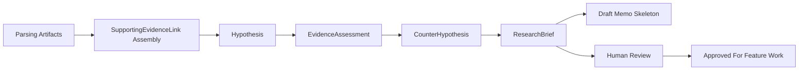

# Hypothesis Lifecycle

## Purpose

Day 4 adds the first disciplined research workflow on top of the Day 3 evidence layer.

The goal is not to produce polished prose. The goal is to produce one compact, reviewable thesis and one compact, reviewable critique that later feature work can trust.

## Day 4 Input Boundary

The workflow consumes persisted parsing artifacts, not raw documents:

- `ExtractedClaim`
- `GuidanceChange`
- `ExtractedRiskFactor`
- `ToneMarker`
- linked `EvidenceSpan`
- optional normalized `Company` and document context

This keeps the research layer downstream of exact-span evidence and upstream of features or signals.

## Lifecycle

## Current Day 4 Steps

### 1. Support-link assembly

- only exact evidence spans are linked
- only claims and guidance changes count as direct support
- tone markers do not count as direct support on their own
- cross-document leaps are converted into assumptions, not hidden as facts

### 2. Hypothesis generation

- produce at most one candidate hypothesis per company and current evidence slice
- require at least two supporting evidence links
- require at least two extracted artifacts
- require support across at least two documents
- keep stance at the research layer: `positive`, `negative`, `mixed`, or `monitor`

### 3. Evidence grading

- `strong`: 3+ support links across 2+ documents with direct claim or outlook support
- `moderate`: 2+ support links across 2+ documents
- `weak`: some direct support, but too narrow
- `insufficient`: no direct support or only tone/context evidence

### 4. Critique generation

- prefer explicit risk factors and cautionary tone markers when available
- if contradiction is thin, challenge assumptions and causal jumps anyway
- require explicit missing evidence and at least one challenged assumption

### 5. Research brief assembly

- package context, core hypothesis, counter-hypothesis, support links, uncertainty, and next validation steps
- remain structured and memo-ready
- do not collapse into unsupported narrative prose

## What Counts As Sufficient Support

Support is sufficient for a Day 4 hypothesis only when:

- exact source-linked evidence spans exist
- the support is grounded in extracted claims or guidance changes
- the evidence comes from more than one document
- the workflow can state assumptions and invalidation conditions explicitly

Support is not sufficient when:

- the output relies only on tone markers
- the output depends on unstated causal leaps
- only one narrow source supports the thesis
- provenance cannot be traced back to exact source spans

## Human Review Requirement

Every Day 4 artifact remains review-bound:

- `Hypothesis.review_status`
- `EvidenceAssessment.review_status`
- `CounterHypothesis.review_status`
- `ResearchBrief.review_status`

Every Day 4 artifact also carries a separate validation lifecycle:

- `Hypothesis.validation_status`
- `EvidenceAssessment.validation_status`
- `CounterHypothesis.validation_status`
- `ResearchBrief.validation_status`

Review status answers "has a human accepted or blocked this artifact?"

Validation status answers "has the thesis or critique actually been checked, stress-tested, or invalidated by later evidence?"

No Day 4 artifact is automatically promoted into a feature or signal.

## Downstream Contract

Later feature and signal work should consume:

- reviewed `Hypothesis`
- reviewed `CounterHypothesis`
- reviewed `EvidenceAssessment`
- exact `SupportingEvidenceLink`

Later systems must not consume:

- memo prose as a substitute for evidence
- unsupported assumptions as if they were facts
- hypotheses that remain below human review thresholds
- artifacts that remain unvalidated when later stages require validated research inputs

## Known Day 4 Weaknesses

- the workflow is deterministic and template-based, not model-assisted
- the thesis and critique are still single-company and single-thesis
- evidence ranking is narrow and not materiality-aware
- review and validation state exist in schema form, but not yet as an interactive workflow
